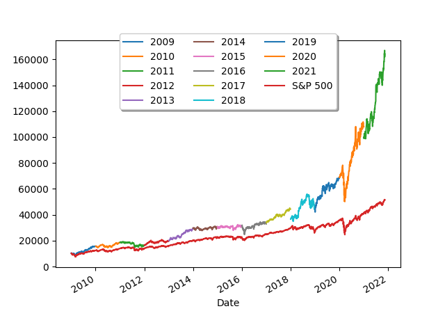

# GlassdoorStockProjection

Historic stock analysis of top Glassdoor companies. 

## Example

Below example shows historic returns since 2009 with an initial investment of $10,000.

New companies are selected from Glassdoor at the beginning of each year.

Earnings from the prior year are reinvested.

There is a maximum of 10 companies in the portfolio.

A detailed breakdown of stock purchases are shown below.

### For year 2009, brought $10223.99 -> $15582.77 for a gain of $5358.78

- Bought 51 shares of NYSE: GIS at $19.64 a share for a total of $1001.82
- Bought 235 shares of NASDAQ: NFLX at $4.26 a share for a total of $1002.77
- Bought 44 shares of NASDAQ: ADBE at $23.02 a share for a total of $1012.88
- Bought 7 shares of NASDAQ: GOOGL at $160.82 a share for a total of $1125.74
- Bought 34 shares of NYSE: SAP at $29.71 a share for a total of $1010.37
- Bought 84 shares of NASDAQ: NTAP at $12.04 a share for a total of $1011.80
- Bought 46 shares of NASDAQ: INTU at $22.10 a share for a total of $1016.64
- Bought 26 shares of NYSE: FDS at $39.23 a share for a total of $1020.05
- Bought 24 shares of NYSE: PG at $42.29 a share for a total of $1015.13
- Bought 31 shares of NYSE: CAT at $32.47 a share for a total of $1006.74

### For year 2010, brought $15699.03 -> $18433.73 for a gain of $2734.69

- Bought 151 shares of NYSE: LUV at $10.36 a share for a total of $1564.88
- Bought 66 shares of NYSE: GIS at $23.79 a share for a total of $1570.78
- Bought 37 shares of NYSE: PG at $42.46 a share for a total of $1571.33
- Bought 68 shares of NYSE: JNPR at $22.96 a share for a total of $1561.60
- Bought 103 shares of NASDAQ: NATI at $15.23 a share for a total of $1569.03
- Bought 5 shares of NASDAQ: GOOGL at $313.68 a share for a total of $1568.44
- Bought 56 shares of NASDAQ: NTAP at $27.88 a share for a total of $1561.43
- Bought 11 shares of NYSE: GS at $145.34 a share for a total of $1598.78
- Bought 27 shares of NYSE: FDS at $58.20 a share for a total of $1571.47
- Bought 46 shares of NYSE: MDT at $33.94 a share for a total of $1561.26

### For year 2011, brought $18633.90 -> $16306.75 for a gain of $-2327.15

- Bought 150 shares of NYSE: LUV at $12.29 a share for a total of $1843.99
- Bought 76 shares of NYSE: GIS at $24.54 a share for a total of $1865.07
- Bought 112 shares of NASDAQ: OSTK at $16.59 a share for a total of $1858.08
- Bought 40 shares of NASDAQ: NTAP at $46.81 a share for a total of $1872.77
- Bought 13 shares of NYSE: GS at $146.69 a share for a total of $1907.06
- Bought 94 shares of NASDAQ: NATI at $19.79 a share for a total of $1861.09
- Bought 183 shares of NASDAQ: AAPL at $10.09 a share for a total of $1846.74
- Bought 64 shares of NASDAQ: ADI at $29.08 a share for a total of $1861.25
- Bought 40 shares of NYSE: PG at $46.38 a share for a total of $1855.51
- Bought 69 shares of NASDAQ: SNPS at $26.98 a share for a total of $1862.30

### For year 2012, brought $16501.92 -> $19712.98 for a gain of $3211.06

- Bought 5 shares of NASDAQ: GOOGL at $333.03 a share for a total of $1665.19
- Bought 407 shares of NYSEAMERICAN: REI at $4.01 a share for a total of $1632.07
- Bought 130 shares of NASDAQ: AAPL at $12.59 a share for a total of $1636.95
- Bought 57 shares of NYSE: GIS at $28.75 a share for a total of $1638.98
- Bought 65 shares of NYSE: CRM at $25.29 a share for a total of $1644.49
- Bought 23 shares of NYSE: CVX at $73.99 a share for a total of $1701.89
- Bought 209 shares of NYSE: LUV at $7.82 a share for a total of $1635.41
- Bought 79 shares of NASDAQ: NATI at $20.85 a share for a total of $1647.53
- Bought 35 shares of NASDAQ: CTXS at $47.52 a share for a total of $1663.30
- Bought 39 shares of NASDAQ: QCOM at $41.95 a share for a total of $1636.07

### For year 2013, brought $20067.13 -> $29298.40 for a gain of $9231.26

- Bought 6 shares of NASDAQ: GOOGL at $361.98 a share for a total of $2171.92
- Bought 93 shares of NASDAQ: NATI at $21.36 a share for a total of $1987.20
- Bought 202 shares of NYSE: LUV at $9.77 a share for a total of $1975.38
- Bought 26 shares of NYSE: CVX at $76.50 a share for a total of $1989.09
- Bought 42 shares of NYSE: IT at $47.41 a share for a total of $1991.63
- Bought 47 shares of NASDAQ: AKAM at $42.15 a share for a total of $1981.51
- Bought 38 shares of NASDAQ: WDAY at $52.90 a share for a total of $2010.57
- Bought 22 shares of NYSE: CMI at $89.86 a share for a total of $1977.09
- Bought 337 shares of NYSEAMERICAN: REI at $5.84 a share for a total of $1971.44
- Bought 47 shares of NYSE: CRM at $42.79 a share for a total of $2011.24

### For year 2014, brought $29889.42 -> $30230.86 for a gain of $341.43

- Bought 44 shares of NYSE: TWTR at $67.5  share for a total of $2970.00
- Bought 45 shares of NYSE: EMN at $65.21 a share for a total of $2934.60
- Bought 61 shares of NYSE: GWRE at $48.13 a share for a total of $2936.53
- Bought 6 shares of NASDAQ: GOOGL at $557.11 a share for a total of $3342.70
- Bought 39 shares of NYSE: DE at $76.57 a share for a total of $2986.37
- Bought 51 shares of NASDAQ: QCOM at $57.63 a share for a total of $2939.38
- Bought 33 shares of NYSE: CVX at $88.86 a share for a total of $2932.50
- Bought 30 shares of NASDAQ: COST at $98.46 a share for a total of $2954.05
- Bought 42 shares of NASDAQ: INTU at $70.51 a share for a total of $2961.66
- Bought 42 shares of NYSE: IT at $69.80 a share for a total of $2931.60

### For year 2015, brought $30765.86 -> $30893.89 for a gain of $128.02

- Bought 6 shares of NASDAQ: GOOGL at $529.54 a share for a total of $3177.29
- Bought 24 shares of NASDAQ: FFIV at $130.33 a share for a total of $3127.92
- Bought 37 shares of NYSE: CVX at $83.46 a share for a total of $3088.10
- Bought 42 shares of NYSE: PG at $73.53 a share for a total of $3088.39
- Bought 51 shares of NASDAQ: QCOM at $59.64 a share for a total of $3041.79
- Bought 75 shares of NYSE: LUV at $40.52 a share for a total of $3039.03
- Bought 42 shares of NASDAQ: ADBE at $72.33 a share for a total of $3038.27
- Bought 35 shares of NYSE: SYK at $86.51 a share for a total of $3028.07
- Bought 123 shares of NASDAQ: AAPL at $24.74 a share for a total of $3043.75
- Bought 37 shares of NYSE: IT at $83.59 a share for a total of $3093.19

### For year 2016, brought $31819.50 -> $32886.45 for a gain of $1066.94

- Bought 54 shares of NYSE: GWRE at $58.15 a share for a total of $3140.10
- Bought 57 shares of NYSE: HUBS at $54.88 a share for a total of $3128.72
- Bought 5 shares of NASDAQ: GOOGL at $759.44 a share for a total of $3797.20
- Bought 127 shares of NASDAQ: ZG at $24.51 a share for a total of $3112.77
- Bought 55 shares of NYSE: EMN at $56.35 a share for a total of $3099.75
- Bought 27 shares of NASDAQ: EXPE at $115.68 a share for a total of $3123.44
- Bought 34 shares of NASDAQ: ADBE at $91.97 a share for a total of $3126.98
- Bought 70 shares of NYSE: DAL at $44.22 a share for a total of $3095.62
- Bought 128 shares of NASDAQ: AAPL at $24.25 a share for a total of $3104.18
- Bought 137 shares of NYSE: TWTR at $22.55 a share for a total of $3090.71

### For year 2017, brought $33787.36 -> $44392.42 for a gain of $10605.05

- Bought 5 shares of NASDAQ: GOOGL at $808.01 a share for a total of $4040.05
- Bought 32 shares of NASDAQ: ADBE at $103.48 a share for a total of $3311.36
- Bought 31 shares of NYSE: CLX at $106.68 a share for a total of $3307.21
- Bought 110 shares of NASDAQ: PCTY at $30.09 a share for a total of $3309.90
- Bought 41 shares of NYSE: SAP at $80.28 a share for a total of $3291.50
- Bought 47 shares of NYSE: CRM at $70.54 a share for a total of $3315.38
- Bought 79 shares of NASDAQ: FORR at $41.83 a share for a total of $3304.86
- Bought 30 shares of NASDAQ: INTU at $110.15 a share for a total of $3304.68
- Bought 72 shares of NYSE: DAL at $45.71 a share for a total of $3291.47
- Bought 49 shares of NASDAQ: AKAM at $67.56 a share for a total of $3310.92

### For year 2018, brought $45473.97 -> $47088.39 for a gain of $1614.41

- Bought 341 shares of NYSE: BCSF at $13.05 a share for a total of $4451.17
- Bought 5 shares of NASDAQ: GOOGL at $1073.20 a share for a total of $5366.04
- Bought 56 shares of NASDAQ: LULU at $79.69 a share for a total of $4462.64
- Bought 50 shares of NYSE: HUBS at $89.44 a share for a total of $4472.49
- Bought 42 shares of NYSE: SAP at $105.91 a share for a total of $4448.40
- Bought 43 shares of NYSE: CRM at $104.41 a share for a total of $4489.63
- Bought 83 shares of NYSE: DAL at $53.52 a share for a total of $4442.16
- Bought 112 shares of NASDAQ: DOCU at $39.72 a share for a total of $4449.75
- Bought 69 shares of NYSE: LUV at $64.44 a share for a total of $4446.84
- Bought 90 shares of NASDAQ: NVDA at $49.38 a share for a total of $4444.81

### For year 2019, brought $48055.11 -> $68285.14 for a gain of $20230.03

- Bought 364 shares of NYSE: BCSF at $12.95 a share for a total of $4714.08
- Bought 76 shares of NASDAQ: ZM at $62.0  share for a total of $4712.00
- Bought 5 shares of NASDAQ: GOOGL at $1054.68 a share for a total of $5273.40
- Bought 39 shares of NASDAQ: LULU at $123.34 a share for a total of $4810.64
- Bought 102 shares of NYSE: LUV at $46.32 a share for a total of $4725.32
- Bought 35 shares of NYSE: CRM at $135.55 a share for a total of $4744.25
- Bought 31 shares of NASDAQ: ISRG at $155.34 a share for a total of $4815.64
- Bought 38 shares of NYSE: HUBS at $125.27 a share for a total of $4760.63
- Bought 116 shares of NASDAQ: DOCU at $40.81 a share for a total of $4735.11
- Bought 80 shares of NASDAQ: PCTY at $59.54 a share for a total of $4763.99

### For year 2020, brought $68986.44 -> $107962.46 for a gain of $38976.02

- Bought 43 shares of NYSE: HUBS at $162.57 a share for a total of $6990.51
- Bought 427 shares of NYSE: BCSF at $16.02 a share for a total of $6840.73
- Bought 90 shares of NASDAQ: DOCU at $75.90 a share for a total of $6831.00
- Bought 35 shares of NASDAQ: ISRG at $199.08 a share for a total of $6968.03
- Bought 125 shares of NYSE: LUV at $54.62 a share for a total of $6828.71
- Bought 5 shares of NASDAQ: GOOGL at $1368.68 a share for a total of $6843.40
- Bought 115 shares of NASDAQ: NVDA at $59.83 a share for a total of $6880.88
- Bought 44 shares of NASDAQ: MSFT at $157.90 a share for a total of $6947.75
- Bought 30 shares of NASDAQ: LULU at $233.41 a share for a total of $7002.59
- Bought 69 shares of NYSE: CPT at $99.31 a share for a total of $6852.81

### For year 2021, brought $109911.65 -> $164239.70 for a gain of $54328.04

- Bought 960 shares of NYSE: BCSF at $11.25 a share for a total of $10805.22
- Bought 83 shares of NASDAQ: NVDA at $131.03 a share for a total of $10876.03
- Bought 28 shares of NYSE: HUBS at $387.73 a share for a total of $10856.71
- Bought 7 shares of NASDAQ: GOOGL at $1726.13 a share for a total of $12082.91
- Bought 279 shares of NYSE: DAL at $38.72 a share for a total of $10805.66
- Bought 31 shares of NASDAQ: LULU at $356.39 a share for a total of $11048.39
- Bought 50 shares of NASDAQ: MSFT at $216.27 a share for a total of $10813.76
- Bought 715 shares of NYSEARCA: META at $15.11 a share for a total of $10810.79
- Bought 46 shares of NYSE: SYK at $237.26 a share for a total of $10914.03
- Bought 49 shares of NASDAQ: DOCU at $222.41 a share for a total of $10898.09